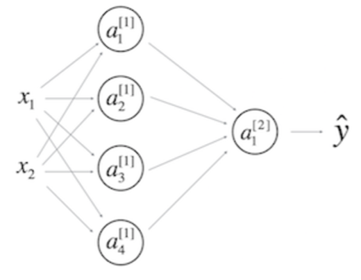
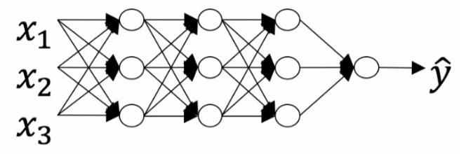
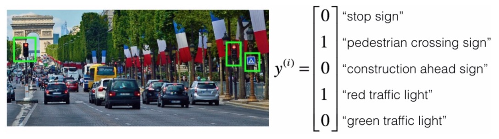
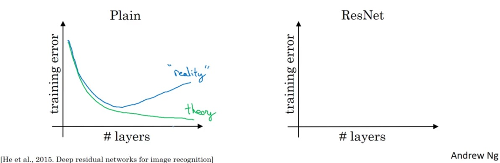
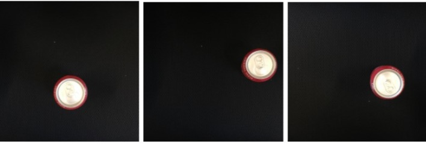
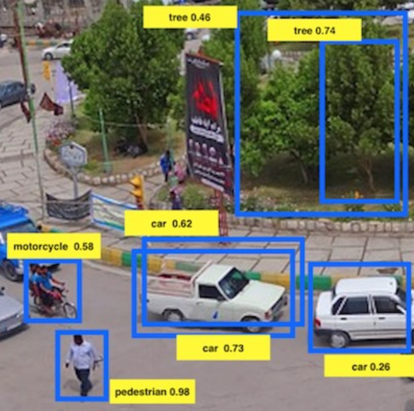
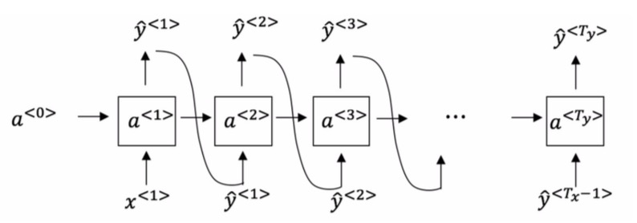
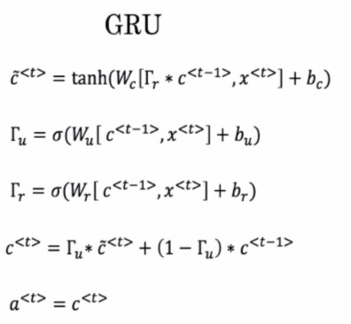
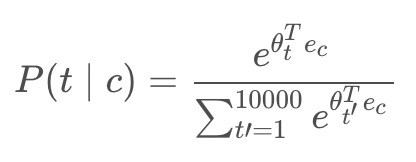
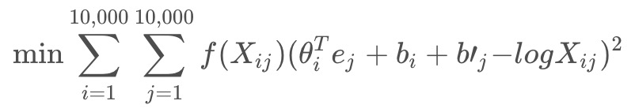

# <u>课程</u>1 - 神经网络和深度学习

1.tanh激活函数通常比隐藏层单元的sigmoid激活函数效果更好，因为其输出的平均值更接近于零，因此它将数据集中在下一层是更好的选择，请问正确吗？

- 【`★`】True
- 【 】 False

> tanh的输出在-1和1之间，因此它将数据集中在一起，使得下一层的学习变得更加简单。


2.您正在构建一个识别黄瓜（y = 1）与西瓜（y = 0）的二元分类器。 你会推荐哪一种激活函数用于输出层？

- 【 】 ReLU
- 【 】 Leaky ReLU
- 【`★`】sigmoid
- 【 】 tanh

注意：来自sigmoid函数的输出值可以很容易地理解为概率。

> Sigmoid输出的值介于0和1之间，这使其成为二元分类的一个非常好的选择。 如果输出小于0.5，则可以将其归类为0，如果输出大于0.5，则归类为1。 它也可以用tanh来完成，但是它不太方便，因为输出在-1和1之间。


3.假设你已经建立了一个神经网络。 您决定将权重和偏差初始化为零。 以下哪项陈述是正确的？

【★】第一个隐藏层中的每个神经元节点将执行相同的计算。 所以即使经过多次梯度下降迭代后，层中的每个神经元节点都会计算出与其他神经元节点相同的东西。
【 】 第一个隐藏层中的每个神经元将在第一次迭代中执行相同的计算。 但经过一次梯度下降迭代后，他们将学会计算不同的东西，因为我们已经“破坏了对称性”。
【 】第一个隐藏层中的每一个神经元都会计算出相同的东西，但是不同层的神经元会计算不同的东西，因此我们已经完成了“对称破坏”。
【 】即使在第一次迭代中，第一个隐藏层的神经元也会执行不同的计算， 他们的参数将以自己的方式不断发展。

> 每个神经元结点相同不代表没有学习到有用的决策边界


4.Logistic回归的权重w应该随机初始化，而不是全零，因为如果初始化为全零，那么逻辑回归将无法学习到有用的决策边界，因为它将无法“破坏对称性”，是正确的吗？

- 【 】True
- 【`★`】False

> 逻辑回归没有隐藏层。如果将权重初始化为零，输入第一个样本x，模型将输出零。
> 但逻辑回归的导数取决于输入x（因为没有隐藏层），并且输入x不是零。
> 所以在第二次迭代中，权重W值遵循x的分布，并且如果x不是一个常数向量，那么它们(w1,w2,...)之间是不同的。


5.看一下下面的单隐层神经网络：



- [ ] W[1] 的维度是 (2, 4)
- [x] b[1] 的维度是 (4, 1)
- [x] W[1] 的维度是 (4, 2)
- [ ] b[1] 的维度是 (2, 1)
- [x] W[2] 的维度是 (1, 4)
- [ ] b[2] 的维度是 (4, 1)
- [ ] W[2] 的维度是 (4, 1)
- [x] b[2] 的维度是 (1, 1)


6.在和上一个相同的网络中，Z[1] 和 A[1]的维度是多少？

- [ ] Z[1] 和 A[1] 的维度都是 (4, 1)

- [ ] Z[1] 和 A[1] 的维度都是 (1, 4)

- [x] Z[1] 和 A[1] 的维度都是 (4, m)
    ```diff
    m为样本数
    ```
    
- [ ] Z[1] 和 A[1] 的维度都是 (4, 2)


7.下列哪个说法是正确的？

- [x] 神经网络的更深层通常比前面层计算更复杂的输入特征。
- [ ] 神经网络的前面层通常比更深层计算更复杂的输入特性。


8.下面关于神经网络的说法正确的是：


- [x] 总层数L为4，隐藏层层数为3。
    ```diff
    网络层数按隐藏层数+1计算。输入和输出层不算作隐藏层。
    ```
    
- [ ] 总层数L为3，隐藏层层数为3。

- [ ] 总层数L为4，隐藏层层数为4。

- [ ] 总层数L为5，隐藏层层数为4。

    ```diff
    一般来说
    W[l]的形状是（n[l]，n[l-1]）
    b[l]的形状是（n[l]，1）
    ```


9.在前向传播期间，在层l的前向传播函数中，您需要知道层l中的激活函数（Sigmoid，tanh，ReLU等）是什么， 在反向传播期间，相应的反向传播函数也需要知道第l层的激活函数是什么，因为梯度是根据它来计算的。这样描述正确吗？

- [x] 正确
- [ ] 错误
    ```diff
    不同激活函数有不同的导数。在反向传播期间，需要知道正向传播中使用哪种激活函数才能计算正确的导数。
    ```


10.有一些功能具有以下属性：

>(i) 利用浅网络电路计算一个函数时，需要一个大网络（我们通过网络中的逻辑门数量来度量大小），但是（ii）使用深网络电路来计算它，只需要一个指数较小的网络。真/假？
- [x] 正确
    ```diff
    深层的网络隐藏单元数量相对较少，隐藏层数目较多，
    如果浅层的网络想要达到同样的计算结果则需要指数级增长的单元数量才能达到。
    ```
    
- [ ] 错误


# 课程2 - 改善深层神经网络

11.如果你的神经网络模型似乎有很高的【偏差】，下列哪个尝试是可能解决问题的？

- [ ] 添加正则化
- [ ] 获取更多的测试数据
- [x] 增加每个隐藏层中的神经元个数
- [x] 加深神经网络
- [ ] 获取更多的训练数据


12.如果你的神经网络模型似乎有很高的【方差】，下列哪个尝试是可能解决问题的？

- [x] 添加正则化
- [ ] 获取更多的测试数据
- [ ] 增加每个隐藏层中的神经元个数
- [ ] 加深神经网络
- [x] 获取更多的训练数据


13.什么是权重衰减？

- [x] 一种正则化技术（如L2正则化），使得每次迭代时，权重都缩小。
- [ ] 训练过程中逐渐降低学习率的过程。
- [x] <u>权重的逐渐损坏，如果神经网络是在有噪声的数据上训练的。</u>
- [ ] 通过对权重值施加一个上限来避免梯度消失的一种技术。


14.当你增加正则化超参数lambda时会发生什么？

- [x] <u>权重会变得更小（接近0）</u>
- [ ] 权重会变得更大（远离0）
- [ ] 加倍lambda会粗略地导致权重加倍
- [ ] 梯度下降在每次迭代中采取更大的步距（与lambda成比例）


15.利用Inverted-dropout技术，在测试的时候：

- [ ] <u>使用dropout（随机失活神经元），不保留训练过程计算中使用过的1/keep-prob因子。</u>
- [ ] 使用dropout（随机失活神经元），保留训练过程计算中使用过的1/keep-prob因子。
- [ ] 不使用dropout（不随机失活神经元），保留训练过程计算中使用过的1/keep-prob因子。
- [x] <u>不使用dropout（不随机失活神经元），不保留训练过程计算中使用过的1/keep-prob因子。</u>


16.将参数keep_prob从（比如说）0.5增加到0.6可能会导致以下情况

- [ ] 增强正则化效应。
- [x] 减弱正则化效应。
- [ ] <u>使神经网络以较大的训练集误差结束</u>
- [x] <u>使神经网络以较小的训练集误差结束</u>


17.以下哪些技术可用于减少方差（减少过拟合）：

- [ ] Xavier初始化
- [x] 数据增强
- [ ] <u>梯度检查</u>
- [ ] 梯度爆炸
- [x] L2 正则化
- [ ] 梯度消失
- [x] Dropout


18.为什么最好的mini-batch的大小通常不是1也不是m，而是介于两者之间？

- [ ] <u>如果mini-batch大小为m，那么会出现随机梯度下降，这通常比小批量梯度下降慢。</u>
- [x] <u>如果mini-batch大小为m，那么会出现批量梯度下降，这需要在进行训练之前对整个训练集进行处理。</u>
- [x] 如果mini-batch大小为1，则会失去mini-batch中矢量化带来的的好处。
- [ ] 如果mini-batch大小为1，那么需要在进行训练之前对整个训练集进行处理。

    ```diff
    批量梯度下降
    随机梯度下降
    小批量梯度下降
    ```


19.假设在一个深度学习网络中批处理梯度下降花费了太多的时间来找到一个值的参数值，该值对于成本函数J(W[1],b[1],…,W[L],b[L])来说是很小的值。 以下哪些方法可以帮助找到J值较小的参数值？

- [x] 尝试调整学习率α
- [ ] 尝试把权值初始化为0
- [x] 尝试对权重进行更好的随机初始化
- [x] 尝试使用mini-batch梯度下降法
- [x] 尝试使用Adam算法


20.关于Adam算法，下列哪一个陈述是错误的？

- [x] Adam结合了RMSProp和Momentum的优势
- [ ] Adam应该用于批量梯度计算，而不是用于mini-batch
- [x] <u>Adam中的学习速率超参数α通常需要调整。</u>
- [x] Adam中，超参数β1、β2和ε通常使用“默认”值（β1=0.9，β2=0.999，ε=10−8）


21.如果在大量的超参数中搜索最佳的参数值，那么应该尝试在网格中搜索而不是使用随机值，以便更系统的搜索，而不是依靠运气，请问这句话是正确的吗？

- [ ] 正确
- [x] 错误


22.如果您认为β（动量超参数）介于0.9和0.99之间，那么推荐采用以下哪一种方法来对β值进行取样？

- [ ] A.

      r = np.random.rand()
      beta = r*0.09 + 0.9

- [x] B.

      r = np.random.rand()
      beta = 1-10**(- r - 1)

  ```diff
      r在0-1之间
      当r=0时，β=0.9; 当r=1时，β=0.99。
  ```

- [ ] C.

      r = np.random.rand()
      beta = 1-10**(- r + 1)

- [ ] D.

      r = np.random.rand()
      beta = r*0.9 + 0.09


23.在批量标准化中，如果将其应用于神经网络的第l层，那么需要标准化什么？

- [ ] b[l]
- [ ] <u>a</u>[l]
- [x] z[l]
- [ ] W[l]


24.批处理标准化中关于 γ 和 β 的以下哪些陈述是正确的？

- [ ] 每层有一个γ∈R的全局变量和一个β∈R的全局变量，并适用于该层中的所有隐藏单元。
- [x] 它们可以在Adam、带有动量的梯度下降 或 RMSprop 使中用，而不仅仅是用梯度下降来学习。
- [ ] 最优值为γ=√（σ^2+ε），β=μ。
- [ ] β和γ是算法的超参数，我们通过随机抽样调整。
- [x] <u>它们设定给定层的线性变量 z[l] 的均值和方差。</u>


# 课程3 - 结构化机器学习项目

25.在设置了训练/验证/测试集之后，地方议会再次给你了1,000,000张图片，称为“公民数据”。 显然，和平之城的公民非常害怕鸟类，他们自愿为天空拍照并贴上标签，从而为这些额外的1,000,000张图像贡献力量。 这些图像与地方议会最初给你的图像分布不同，但你认为它对你的算法有帮助。

> 你不应该将公民数据添加到训练集中，因为这会导致训练/验证/测试集分布变得不同，从而负面影响模型在验证集和测试集性能表现。对/错？

- [ ] 正确

- [x] 错误

  将此数据添加到训练集将改变训练集的分布。然而，训练集和验证集的分布不同并不是问题。
  相反，验证集和测试集的分布不同，将造成非常多的问题。


26.你训练了一个系统，其误差度如下（误差度 = 100％ - 准确度）：

|   训练集误差   |   4.0%   |
| :------------: | :------: |
| __验证集误差__ | __4.5%__ |

>  这表明，提高性能的一个很好的途径是训练一个更大的网络，以降低4%的训练误差。你同意吗？

- [ ] 是的，因为有4%的训练误差表明你有很高的偏差。
- [ ] <u>是的，因为这表明你的模型的偏差高于方差。</u>
- [ ] 不同意，因为方差高于偏差。
- [x] 不同意，因为没有足够的信息，这什么也说明不了。


27.你发现一个由鸟类专家组成的团队在辩论和讨论每张图像后，得到了更好的0.1%的表现，所以你将其定义为“人类表现”。在对算法进行深入研究之后，最终得出以下结论：

|    人类表现    |   0.1%   |
| :------------: | :------: |
| __训练集误差__ | __2.0%__ |
| __验证集误差__ | __2.1%__ |

> 根据你的资料，以下四个选项中哪两个尝试起来是最有希望的？（两个选项。）

- [x] 训练一个更大的模型，试图在训练集上做得更好。
- [x] <u>尝试减少正则化。</u>
- [ ] 尝试增加正则化。
- [ ] 获得更大的训练集以减少差异。


28.在一年后，你完成了这个项目，你终于实现了：

|    人类表现    |   0.1%    |
| :------------: | :-------: |
| __训练集误差__ | __0.05%__ |
| __验证集误差__ | __0.05%__ |

> 你能得出什么结论？ （检查所有选项。）

- [x] <u>如果测试集足够大，保证这0.05%的误差估计是准确的，这意味着贝叶斯误差是小于等于0.05的。</u>
- [ ] 只有0.09％的进步空间，你应该很快就能够将剩余的差距缩小到0％
- [ ] 这是统计异常(或者是统计噪声的结果)，因为它不可能超过人类表现。
- [x] 现在很难衡量可避免的偏差，因此今后的进展将会放缓。


29.事实证明，和平之城也雇佣了你的竞争对手来设计一个系统。你的系统和竞争对手都被提供了相同的运行时间和内存大小的系统，但你的系统有更高的准确性。然而，当你和你的竞争对手的系统进行测试时，和平之城实际上更喜欢竞争对手的系统，因为即使你的整体准确率更高，你也会有更多的假阴性结果(当鸟在空中时没有发出警报)。你该怎么办？

- [ ] 查看开发过程中开发的所有模型，找出假阴性错误率最低的模型。
- [ ] 要求你的团队在开发过程中同时考虑准确性和假阴率。
- [x] 重新思考此任务合适的指标，并要求你的团队调整到新指标。
- [ ] <u>选择假阴率作为新指标，并以这个新指标来驱动所有进一步的开发。</u>


30.你轻易击败了你的竞争对手，你的系统现在被部署在和平之城中，并且保护公民免受鸟类攻击！ 但在过去几个月中，一种新的鸟类已经慢慢迁移到该地区，因此你系统的性能会逐渐下降，因为你的系统正在测试一种新类型的数据。
你只有1000张新鸟类的图像，地方政府希望在未来3个月内你能有一个更好的系统。你应该先做什么？

- [x] 你必须定义一个新的评估指标（使用新的验证/测试集）在 加了新物种的数据集上，并使用它来驱动你的团队进一步发展。
- [ ] 把1000张图片放进训练集，以便让系统更好地对这些鸟类进行训练。
- [ ] <u>尝试数据增强/数据合成，以获得更多新型鸟类的图像。</u>
- [ ] 将1,000幅图像添加到你的数据集中，并重新组合成一个新的训练/验证/测试集。


31.地方议会认为在城市里养更多的猫会有助于吓跑鸟类，他们对你在鸟类探测器上的工作感到非常满意，他们也雇佣你来设计一个猫探测器。（WoW~猫检测器是非常有用的，不是吗？）由于有多年猫检测器的工作经验，你有一个巨大的数据集，你有100,000,000猫的图像，训练这个数据需要大约两个星期。

> 你同意下面哪些说法？（检查所有选项。）

- [ ] 建立了一个效果比较好的鸟类检测器后，你应该能够采用相同的模型和超参数，并将其应用于猫数据集，因此无需迭代。
- [x] 如果100,000,000个样本足以建立一个足够好的猫检测器，那么你最好只用10,000,00个样本训练，以便在运行实验的速度上获得≈10倍的加速。即使每个模型的性能稍差一点，因为所用的数据较少。
- [ ] <u>需要两周的时间来训练将会限制你开发迭代的速度。</u>
- [ ] <u>购买更快的计算机可以加快团队的开发迭代速度，从而提高团队的生产力。</u>


32.为了帮助你练习机器学习策略，本周我们将介绍另一种场景并询问你将如何做。我们认为这个机器学习项目"模拟器"，可以帮助我们明确是什么在主导机器学习项目进展的。

> 你受雇于一家生产自动驾驶汽车的初创公司。你负责检测图片中的路标（停车标志，行人过路标志，前方施工标志）和交通信号标志（红灯和绿灯），目标是识别哪些对象出现在每个图片中。
> 例如，上面的图片包含一个行人过路标志和红色交通信号灯标志。 
> 

> 有100,000张带标签的图片是使用你汽车的前置摄像头拍摄的。这也是你最关心的数据分布，你认为可以从互联网上获得更大的数据集，即使互联网数据的分布不相同，但也可能对训练有所帮助。

> 你刚刚开始着手这个项目，你该做的第一件事是什么？假设下面的每个步骤将花费大约相等的时间（大约几天）。

- [ ] <u>花几天的时间检测这些任务的人类表现，以便能够得到贝叶斯误差的准确估计。</u>
- [x] <u>花几天时间训练一个基本模型，看看它会犯什么错误。</u>
- [ ] 花几天的时间使用汽车前置摄像头采集更多数据，以便更好地了解每单位时间可收集多少数据。
- [ ] 花几天时间去获取互联网的数据，这样你就能更好地了解哪些数据是可用的。


33.根据上一个问题的表格，一位朋友认为 训练数据分布 比 验证/测试分布 的图片要容易识别得多。你怎么看？

- [ ] <u>你的朋友是对的。 （即训练数据分布的贝叶斯误差可能低于 验证/测试分布）。</u>

- [ ] 你的朋友错了。（即训练数据分布的贝叶斯误差可能比 验证/测试分布 更高）。

- [x] <u>没有足够的信息来判断你的朋友是对还是错。</u>

    ```diff
    为了了解这一点，我们必须在两个分布上分别测量人的水平误差
    该算法对训练的分布数据有更好的效果。但我们不确定这是因为它被训练在数据上，或者它比验证/测试分布更容易。
    ```


34.你可以买一个专门设计的雨刮，帮助擦掉正面相机上的一些雨滴。 根据上一个问题的表格，你同意以下哪些陈述？

- [x] <u>对于挡风玻璃雨刷可以改善模型的性能而言，2.2％是改善的最大值。</u>

    ```diff
    一般而言，解决了雨滴的问题你的错误率可能不会完全降低2.2%
    如果你的数据集是无限大的, 改善2.2% 将是一个理想的估计, 买一个雨刮是应该可以改善性能的。
    ```

- [ ] 对于挡风玻璃雨刷可以改善模型的性能而言，2.2％是改善最小值。

- [ ] 对于挡风玻璃雨刷可以改善模型的性能而言，改善的性能就是2.2％。

- [ ] <u>在最坏的情况下，2.2%将是一个合理的估计，因为挡风玻璃刮水器会损坏模型的性能。</u>


35.到目前为止，你的算法仅能识别红色和绿色交通灯，该公司的一位同事开始着手识别黄色交通灯（一些国家称之为橙色光而不是黄色光，我们将使用美国的黄色标准），含有黄色灯的图像非常罕见，而且她没有足够的数据来建立一个好的模型，她希望你能利用迁移学习帮助她。

> 你将告诉你同事什么？

- [x] 她应该尝试使用在你的数据集上预先训练过的权重，并用黄光数据集进行进一步的微调。

    ```diff
    你已经在一个庞大的数据集上训练了你的模型，并且她只有一个小数据集。
     
    尽管标签不同，但你的模型参数已经过训练，
    可以识别道路和交通图像的许多特征，这些特征对于她的问题很有用。 
    
    这对于迁移学习来说是一个完美的例子，她可以从一个与你的架构相同的模型开始，
    改变最后一个隐藏层之后的内容，并使用你的训练参数对其进行初始化。
    ```

- [ ] 如果她有10,000个黄光图像，从你的数据集中随机抽取10,000张图像，并将你和她的数据放在一起，这可以防止你的数据集“淹没”她的黄灯数据集。

- [ ] 你没办法帮助她，因为你的数据分布与她的不同，而且缺乏黄灯标签的数据。

- [ ] <u>建议她尝试多任务学习，而不是使用所有数据进行迁移学习。</u>


36.为了识别红灯和绿灯，你一直在使用这种方法

> * (A): 将图像(x)输入到神经网络，并直接学习映射以预测是否存在红光和/或绿光(y)。

> 一个队友提出了另一种两步走的方法：
>
> * (B)：在这个两步法中，你首先要检测图像中的交通灯（如果有），然后确定交通信号灯中照明灯的颜色。

> 在这两者之间，方法B更多的是端到端的方法，因为它在输入端和输出端有不同的步骤，这种说法正确吗？

- [ ] 正确

- [x] 错误

    ```diff
    （A）是一种端到端的方法，因为它直接将输入(x)映射到输出(y)
    ```


37.如果你有一个____,在上面的问题中方法A往往比B方法更有效，

> 你同意下面哪些说法？（检查所有选项。）

- [x] 大训练集

    ```diff
    在许多领域，据观察，端到端学习在实践中效果更好，但需要大量数据。 如果没有大量的数据，端到端深度学习的应用是效果比较差的。
    ```

- [ ] <u>多任务学习的问题</u>

- [ ] 偏差比较大的问题

- [ ] 高贝叶斯误差的问题


# 课程4 - 卷积神经网络

38.你认为把下面这个过滤器应用到灰度图像会怎么样？ 


- [ ] <u>会检测图像对比度</u>

- [ ] 会检测45度边缘

- [x] <u>会检测垂直边缘</u>

    ```diff
    因为左边的部分是正的，右边的部分是负的。
    ```

- [ ] 会检测水平边缘


39.假设你的输入是一个300×300的彩色（RGB）图像，而你没有使用卷积神经网络。 如果第一个隐藏层有100个神经元，每个神经元与输入层进行全连接，那么这个隐藏层有多少个参数（包括偏置参数）？

- [ ] 9,000,001

- [ ] <u>9,000,100</u>

- [ ] 27,000,001

- [x] <u>27,000,100</u>

    ```diff
    100 * 300 * 300 * 3 + 100 = 27,000,100
    ```


40.假设你的输入是300×300彩色（RGB）图像，并且你使用卷积层和100个过滤器，每个过滤器都是5×5的大小，请问这个隐藏层有多少个参数（包括偏置参数）？

- [ ] 2501

- [ ] 2600

- [ ] 7500

- [x] 7600

    ```diff
    因为是RGB图片，故过滤器的shape为(5, 5, 3)
    每个过滤器对应一个偏置b, 则一个完整的过滤器参数个数为：5 * 5 * 3 + 1 = 76 
    则100个过滤器的参数个数为：76 * 100 = 7600
    ```


41.你有一个63x63x16的输入，并使用大小为7x7的32个过滤器进行卷积，使用步幅为2和无填充，请问输出是多少？

- [x] 29x29x32

    

    ```diff
    代入公式，可得：
    nx = nw = (63 - 7 + 2 * 0)/2 + 1 = 29
    又因为有32个过滤器，故输出尺寸为: (29, 29, 32)
    ```

- [ ] 16x16x16     

- [ ] 16x16x32

- [ ] 29x29x16


42.我们谈到了“参数共享”是使用卷积网络的好处。关于参数共享的下列哪个陈述是正确的？（检查所有选项。）

- [x] 它减少了参数的总数，从而减少过拟合。
- [ ] 它允许为一项任务学习而来的参数，即使针对不同的任务也可以共享（迁移学习）。
- [ ] <u>它允许梯度下降将许多参数设置为零，从而使得连接变得稀疏。</u>
- [x] <u>它允许在整个输入图片或输入三维特征图的多个位置使用特征检测器。</u>


43.我们使用普通的网络结构来训练一个很深的网络，要使得网络适应一个很复杂的功能（比如增加层数)，总会有更低的训练误差。

- [ ] True

- [x] False

    ```diff
    理论上，随着网络的加深，普通网络的训练误差应越来越少，但实际上却是先减后增；
    而ResNet网络可以改善这个缺点。
    ```

    


44.下面计算残差(ResNet)块的公式中，横线上应该分别填什么？ 


- [ ] <u>分别是 0 与 a[l] 。</u>

- [ ] 分别是 z[l] 与 a[l] 。

- [ ] 分别是 0 与 z[l+1] 。

- [x] <u>分别是 a[l] 与 0 。</u>

    ```diff
    a[l+2] = g(z[l+2] + a[l])
           = g(W[l+2]a[l+1] + b[l+2] + a[l])
           = g(W[l+2]g(z[l+1]) + b[l+2] + a[l])
           = g(W[l+2]g(W[l+1]a[l] + b[l+1]) + b[l+2] + a[l])
    ```


45.关于残差网络下面哪个（些）说法是正确的？

- [x] 使用跳越连接能够对反向传播的梯度下降有益，且能够帮你对更深的网络进行训练。
- [x] 跳跃连接能够使得网络轻松地学习残差块中输入输出之间的恒等映射。
- [ ] 有L层的残差网络一共有L^2种跳跃连接的顺序。
- [ ] <u>跳跃连接用一个复杂的非线性函数去计算输入在网络深层中的传递关系。</u>


46.假设你的输入的维度为64x64x16，单个1x1的卷积过滤器含有多少个参数（包括偏差）？

- [ ] 2
- [ ] 1
- [ ] 4097
- [x] 17


47.假设你有一个维度为n[h]×n[w]×n[c]的卷积输入，下面哪个说法是正确的（假设卷积层为1x1，步伐为1，padding为0）？

- [x] <u>你可以使用池化层减少 n[h]、n[w]，但是不能减少 n[c]</u>
- [ ] 你可以使用池化层减少 n[h]、 n[w]和n[c]
- [ ] 你可以使用一个1x1的卷积层来减少n[h]、n[w]和n[c]
- [x] 你能够使用1x1的卷积层来减少n[c]，但是不能减少 n[h]、n[w]


48.下面哪些是使用卷积网络的开源实现（包含模型/权值）的常见原因？

- [ ] <u>通过一个计算机视觉任务训练而来的模型通常可以用来作数据扩充，即使对于不同的计算机视觉任务也是如此。</u>
- [ ] 赢得计算机视觉比赛的技术(如在测试时使用多个multiple crops)，被广泛使用在卷积网络相关的实际部署（或生产系统部署）中。
- [x] 通过一个计算机视觉任务训练而来的参数通常对其他计算机视觉任务的预训练是有帮助的。
- [x] 这是一种快捷方法去实现一个复杂的卷积网络结构。


49.你现在任职于自动化工厂中，你的系统会看到一罐饮料从传送带上下来，你想要对其进行拍照，
然后确定照片中是否有饮料罐，如果有的话就对其进行包装。饮料罐头是圆的，而包装盒是方的，
每一罐饮料的大小是一样的，每个图像中最多只有一罐饮料，现在你有下面的方案可供选择，这里有一些训练集图像： 


- [ ] Logistic unit (用于分类图像中是否有罐头)
- [x] <u>Logistic unit,b_x 和 b_y</u>
- [ ] Logistic unit,b_x,b_y,b_h (因为b_w =b_h，所以只需要一个就行了)
- [ ] <u>Logistic unit,b_x,b_y,b_h,b_w</u>


50.当你训练一个视频中描述的对象检测系统时，里需要一个包含了检测对象的许多图片的训练集，然而边界框不需要在训练集中提供，因为算法可以自己学习检测对象，这个说法对吗？ 

- [ ] 正确
- [x] 错误


51.假如你在下图中的预测框中使用非最大值抑制，其参数是放弃概率≤ 0.4的框，并决定两个框IoU的阈值为0.5，使用非最大值抑制后会保留多少个预测框？ 


- [ ] 3
- [ ] <u>4</u>
- [x] 5
- [ ] 6
- [ ] 7


52.假如你使用YOLO算法，使用19x19格子来检测20个分类，使用5个锚框（anchor box）。
在训练的过程中，对于每个图像你需要输出卷积后的结果y作为神经网络目标值（这是最后一层），y可能包括一些“？”或者“不关心的值”。请问最后的输出维度是多少？

- [ ] 19x19x(25x20)

- [ ] <u>19x19x(5x20)</u>

- [ ] 19x19x(20x25)

- [x] 19x19x(5x25)

    ```diff
    总共20个分类，除去必须的那五个Pc bx by bh bw外，剩下的就是20个分类，所以一个anchor box有25个参数，总共五个anchor box。
    ```


53.在人脸验证中函数d(img1,img2)起什么作用？

- [x] 只需要给出一个人的图片就可以让网络认识这个人。
- [x] <u>为了解决一次学习的问题。</u>
- [ ] 这可以让我们使用softmax函数来学习预测一个人的身份，在这个单元中分类的数量等于数据库中的人的数量加1。
- [ ] 鉴于我们拥有的照片很少，我们需要将它运用到迁移学习中。


54.为了训练人脸识别系统的参数，使用包含了10万个不同的人的10万张图片的数据集进行训练是合理的。

- [ ] 正确

- [x] 错误

    ```diff
    每个人需要多张照片的。
    ```


55.下面哪个是三元组损失的正确定义（把α也考虑进去）？

- [x] max( || f(A) − f(P) ||^2 − || f(A) − f(N) ||^2 + α, 0 )
- [ ] max( || f(A) − f(N) ||^2 − || f(A) − f(P) ||^2 + α, 0 )
- [ ] max( || f(A) − f(N) ||^2 − || f(A) − f(P) ||^2 - α, 0 )
- [ ] max( || f(A) − f(P) ||^2 − || f(A) − f(N) ||^2 - α, 0 )


56.神经风格转换被训练为有监督的学习任务，其中的目标是输入两个图像 (x)，并训练一个能够输出一个新的合成图像(y)的网络。

- [ ] 正确

- [x] 错误

    ```diff
    监督学习需要标签，但是这里的图像没有标签。
    ```


# 课程5 - 序列模型

57.你已经完成了一个语言模型RNN的训练，并用它来对句子进行随机取样，如下图：

在每个时间步t都在做什么？ 

- [ ] (1)使用由RNN输出的概率来选择该时间步的最高概率词作为 ŷ < t>，(2) 然后将训练集中的实际单词传递到下一个时间步。
- [ ] (1)使用由RNN输出的概率来随机抽取该时间步的所选单词作为 ŷ < t> ，(2)然后将训练集中的实际单词传递到下一个时间步。
- [ ] <u>(1)使用由RNN输出的概率来选择该时间步的最高概率词作为 ŷ < t>，(2)然后将该选定单词传递给下一个时间步。</u>
- [x] <u>(1)使用由RNN输出的概率来随机抽取该时间步的所选单词作为ŷ < t> ，(2)然后将该选定单词传递给下一个时间步。</u>


58.假设你正在训练一个 LSTM 网络，你有一个10,000词的词汇表，并且使用一个激活值维度为100的 LSTM 块，在每一个时间步中，Γ_u的维度是多少？

- [ ] 1

- [x] 100

- [ ] <u>300</u>

- [ ] 10000

    ```diff
    Γ_u的向量维度等于LSTM中隐藏单元的数量。
    ```


59.这里有一些GRU的更新方程：  


> Alice建议通过移除 Γ_u来简化GRU，即设置Γ_u＝1。Betty提出通过移除 Γ_r来简化GRU，即设置 Γ_r＝1。哪种模型更容易在梯度不消失问题的情况下训练，即使在很长的输入序列上也可以进行训练？

- [ ] <u>Alice的模型（即移除Γ_u），因为对于一个时间步而言，如果Γ_r≈0，梯度可以通过时间步反向传播而不会衰减。</u>

- [ ] Alice的模型（即移除Γ_u），因为对于一个时间步而言，如果Γ_r≈1，梯度可以通过时间步反向传播而不会衰减。

- [x] <u>Betty的模型（即移除Γ_r），因为对于一个时间步而言，如果Γ_u≈0，梯度可以通过时间步反向传播而不会衰减。</u>

- [ ] Betty的模型（即移除Γ_r），因为对于一个时间步而言，如果Γ_u≈1，梯度可以通过时间步反向传播而不会衰减。

    ```diff
    要使信号反向传播而不消失，我们需要 c<t> 高度依赖于 c<t−1> 
    ```


60.假设你为10000个单词学习词嵌入，为了捕获全部范围的单词的变化以及意义，那么词嵌入向量应该是10000维的。

- [ ] 正确
- [x] 错误


61.什么是t-SNE？

- [ ] <u>一种能够解决词向量上的类比的线性变换。</u>
- [x] <u>一种非线性降维算法。</u>
- [ ] 一种用于学习词嵌入的监督学习算法。
- [ ] 一个开源序列模型库。


62.假设你下载了一个已经在一个很大的文本语料库上训练过的词嵌入的数据，然后你要用这个词嵌入来训练RNN并用于识别一段文字中的情感，判断这段文字的内容是否表达了“快乐”。

|           x(输入文本)            | y (是否快乐) |
| :------------------------------: | :----------: |
|         我今天感觉很好!          |      1       |
| 我觉得很沮丧，因为我的猫生病了。 |      0       |
|         真的很享受这个！         |      1       |

> 那么即使“欣喜若狂”这个词没有出现在你的小训练集中，你的RNN也会认为“我欣喜若狂”应该被贴上 y = 1 的标签。

- [x] 正确
- [ ] 错误


63.在学习词嵌入时，我们创建了一个预测 P(target∣context) 的任务，如果这个预测做的不是很好那也是没有关系的，因为这个任务更重要的是学习了一组有用的嵌入词。

- [ ] 正确

- [x] 错误

    ```diff
    embedding matrix就是词预测任务中的一个by-product，是根据train data构造出来的。即使训练后的模型用在test data上效果不好也没关系，关键在于训练出了一个根据train data中word的词嵌入矩阵
    ```


64.假设你有1000个单词词汇，并且正在学习500维的词嵌入，word2vec模型使用下面的softmax函数： 


> 以下说法中哪一个（些）是正确的？

- [x] θ_t 与 e_c 都是500维的向量。
- [ ] θ_t 与 e_c 都是10000维的向量。
- [x] θ_t 与 e_c 都是通过Adam或梯度下降等优化算法进行训练的。
- [ ] 训练之后，θ_t 应该非常接近 e_c，因为 t 和 c 是一个词。


65.这里有一些GRU和LSTM的方程: 


> 以下说法中哪一个（些）是正确的？

- [ ] θ_i 与 e_j 应当初始化为0。

- [x] θ_i 与 e_j 应当使用随机数进行初始化。

- [x] X_ij 是单词 i 在 j 中出现的次数。

- [x] 加权函数 f(.) 必须满足 f(0)=0 。

    ```diff
    加权函数有助于防止仅从非常常见的单词对中学习，它不必满足这个函数。
    ```


66.在集束搜索中，如果增加集束宽度b，以下哪一项是正确的？

- [x] 集束搜索将运行的更慢。
- [x] 集束搜索将使用更多的内存。
- [x] 集束搜索通常将找到更好地解决方案（比如：在最大化概率 P(y∣x)上做的更好）。
- [ ] 集束搜索将在更少的步骤后收敛。


67.在机器翻译中，如果我们在不使用句子归一化的情况下使用集束搜索，那么算法会输出过短的译文。

- [x] 正确
- [ ] 错误


68.假设你正在构建一个能够让语音片段 x 转为译文 y 的基于RNN模型的语音识别系统，你的程序使用了集束搜索来试着找寻最大的 P( y | x ) 的值 y 。
在开发集样本中，给定一个输入音频，你的程序会输出译文 y_hat = “I’m building an A Eye system in Silly con Valley.”，
人工翻译为 y* = “I’m building an AI system in Silicon Valley.”

> 在你的模型中,  
> P( y_hat ∣ x ) = 1.09e-7  
> P( y* ∣ x ) = 7.21e-8  

> 那么，你会增加 集束宽度B 来帮助修正这个样本吗？

- [x] 不会，因为 P( y* ∣ x ) ≤ P( y_hat ∣ x )）表示错误应归因于RNN而不是搜索算法。
- [ ] 不会，因为 P( y* ∣ x ) ≤ P( y_hat ∣ x )）表示错误应归因于搜索算法而不是RNN。
- [ ] 会，因为 P( y* ∣ x ) ≤ P( y_hat ∣ x )）表示错误应归因于RNN而不是搜索算法。
- [ ] 会，因为 P( y* ∣ x ) ≤ P( y_hat ∣ x )）表示错误应归因于搜索算法而不是RNN。